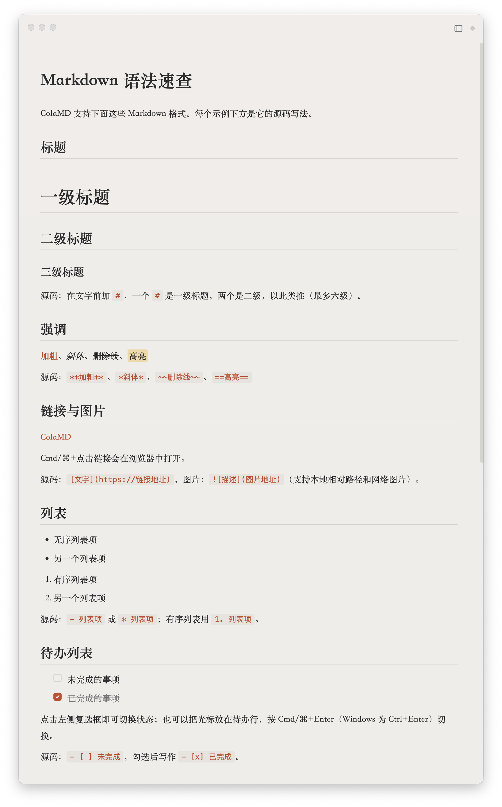
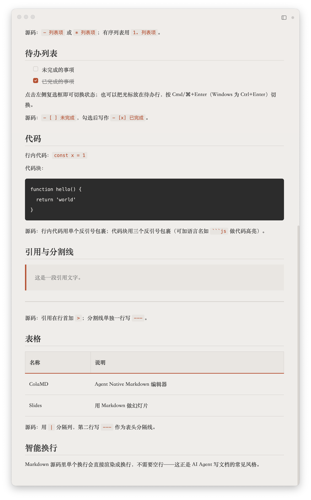

# ColaMD

> 一款免费、优雅、谁都能上手的 Markdown 编辑器。没有工具栏，没有多余的东西，而且文件永远是最新的。

**Language / 语言: [English](README.md) · [中文](README_CN.md)** · [官网](https://colamd.com/)

ColaMD 是一款开源、免费、优雅的 Markdown 编辑器，用于写作、记录和文档。它为「只想好好写字」的人而做：没有工具栏、没有状态栏、不需要任何配置：窗口里只有标题栏、你的文字和文件列表。

它支持所见即所得、12 个内置主题、富文本复制、智能换行、查找替换、文档大纲、PDF / HTML / Word 导出，并支持 macOS、Windows 和 Linux。

无论是什么在写这个文件（Claude Code、Codex 这类 AI Agent，一个脚本，或另一个编辑器），ColaMD 都会立刻显示最新内容，不用重开文件，也不用手动刷新。

[下载](#下载) | [功能](#功能)

---

## 截图

  
  

<em>内置语法速查、交互式待办列表、代码块、引用、表格与智能换行。</em>

## 主题

12 个内置主题，6 浅 6 深，灵感来自 Bear、Notion、iA Writer、Kindle、Solarized、Nord、Gruvbox 和 Dracula。

  

## 功能

- **文件实时同步**: 无论是 AI Agent、脚本还是另一个编辑器改了文件，内容都会立刻出现在编辑器中，不用重开、不用刷新。
- **真正的所见即所得**: 输入 Markdown，直接看到富文本，无需分屏预览。
- **文件与大纲**: 浏览所选目录中的 Markdown 文件，或切换为文档大纲，专注在标题之间导航。
- **源码模式**: 需要查看或直接修改原始 Markdown 时，一键切换源码编辑。
- **待办列表**: 直接点击复选框完成任务，也支持快捷键。
- **高亮与 LaTeX**: 使用 `==高亮文本==`，并通过 KaTeX 渲染数学公式。
- **Mermaid 图表**: Mermaid 代码块在独立隐藏 iframe 中渲染为图表；点击图表即可编辑源码。
- **查找与替换**: 使用 ⌘/Ctrl+F 快速查找内容，支持替换当前匹配项或全部替换。
- **智能换行**: 单个换行直接渲染为换行，符合人类和 AI 工具写 Markdown 的习惯。
- **富文本复制**: 复制后粘贴到公众号、微信、邮件等富文本编辑器，格式完整保留。
- **主题**: 12 个内置主题，在浅色和深色环境中专注写作。
- **最近文件与会话还原**: 「文件 → 最近打开」直达最近 10 篇文档，启动时自动恢复上次编辑位置。
- **编辑器字体设置**: 为编辑器选择任意已安装的系统字体与字号，用户设置优先于主题默认。
- **多窗口**: 独立的编辑器窗口，各自维护保存状态与关闭保护。
- **保存状态提示**: 标题栏安静地显示未保存/已保存状态，随后自动淡出。
- **标题锚点跳转**: 点击文档内锚点链接即可跳转到对应标题，中文标题同样支持。
- **版本更新说明**: 每次更新后的首次启动自动打开内置 changelog，了解变化后不会重复打扰。
- **PDF、HTML 与 Word 导出**: 将 Markdown 文档导出为带主题背景的 PDF、独立 HTML 或可编辑的 Word 文档。
- **阅读页图片导出**: 按电脑或手机阅读页导出 PNG；长文自动续为编号页面。
- **图片路径可移植保存**: 本地图片显示使用安全的 `file://` URL，保存时恢复为相对路径。
- **VS Code 集成**: 在 VS Code 中将当前 Markdown 文件直接打开到 ColaMD。
- **极简设计**: 没有工具栏，没有永久侧边栏，专注于内容本身。
- **跨平台**: 支持 macOS、Windows 和 Linux。

## 与现有 Markdown 工作流配合

ColaMD 不要求你改变现有习惯，也适合与 Obsidian、Typora、VS Code 等 Markdown 软件配合使用。它们共享同一套 `.md` 文件，你可以用不同工具完成不同任务。

## 下载

> 查看 [Releases](https://github.com/marswaveai/colamd/releases) 获取最新构建。

| 平台 | 格式 |
|------|------|
| macOS | `.dmg` |
| Windows | `.exe` |
| Linux | `.AppImage` / `.deb` |

## 路线图

ColaMD 会继续把「免费、优雅、专注」这件事做好：

- v1.1: 实时文件热更新、文件关联、拖拽打开、主题系统
- v1.2: 新图标
- v1.3: Agent 活动指示器、Cmd+点击链接、富文本复制、智能换行、PDF 导出、主题持久化
- v1.6: 更稳的实时同步：原子保存（rename）检测、watcher 自愈、关闭拼写检查
- v1.6.1: 可勾选的待办列表（点击 / ⌘+Enter）、`==高亮==` 语法、Markdown 语法速查
- v1.6.2: 暂时移除 HTML 导出
- v1.7: 同目录文件列表：就地切换文件，Agent 新建/删除文件实时更新；搜索（⌘F）+ LaTeX（⌘⇧E），来自社区 PR #14
- v1.7.1: 待办点击修复、居中的 SVG 对勾、标题栏文件面板开关按钮
- v1.7.2: 可玩演示页：Help → 新功能演示（⌘⇧D），用真实目录展示每个版本的新功能
- v1.7.3: 演示页升级为累积式 changelog：resources/demo/changelog.md 记录每个版本，打开即见
- v1.7.4: 根据社区反馈完善文件面板、源码模式、HTML 导出、Windows 图片路径，并提供 VS Code 集成 MVP
- v1.8.0: Markdown 与 HTML 本地图片均可移植保存，并完成社区反馈中的编辑修复
- v1.8.1: 优化首次启动体验和 macOS 图标；移除 Mermaid 渲染，代码块恢复为原生可编辑体验
- v1.9.0: Word 导出、电脑与手机阅读页图片导出、文档大纲、主题化 PDF 与更轻的启动加载
- v2.0.0: 1000 star 里程碑：Mermaid 图表回归（按底色自动配色）、最近文件与会话还原、编辑器字体设置、标题锚点跳转、多窗口与保存状态提示
- v2.0.1: macOS Universal 版本，同时支持 Apple silicon 与 Intel，并修复自定义主题恢复、Mermaid 渲染恢复和 Windows 更新下载问题
- v2.0.2: 文件面板可调宽（180–420px，记住选择），大纲新增阅读进度高亮与跳转落点闪烁反馈
- v2.0.5：修复「打开所在文件夹」按钮，鼠标移到文档名上即可出现
- v2.0.4：PDF 导出不再把浮层当作正文、撤销不再跨文档、复制到聊天工具不再多出空行、源码模式与文件面板同开不再溢出、文档标题旁新增「打开所在文件夹」入口，并移除靠猜测的 Agent 活动指示器
- v2.0.3: 查找替换、界面语言切换、大文档源码模式降级、更新下载进度与失败重试，以及基于 blockmap 的增量更新
- 未来: 更多主题、编辑器集成与 Markdown 工作流优化

## 开源协议

[MIT](LICENSE)，永久免费。

---

ColaMD 由 [Cola.app](https://cola.app) 开发，作者 [orange2ai](https://github.com/orange2ai)。欢迎提交 Issue、想法和 Pull Request。
